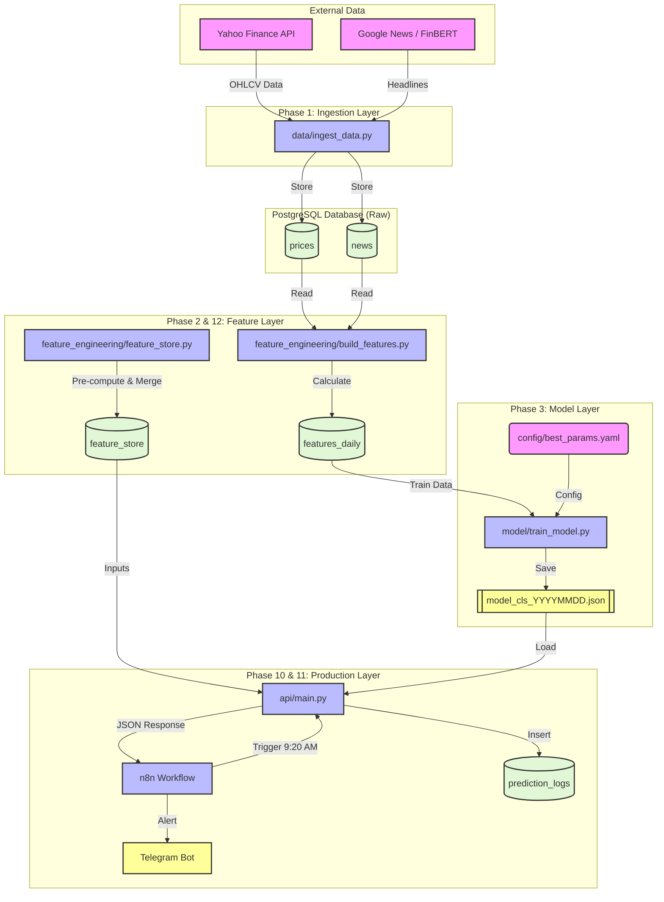

# Indian Market ML Pipeline Architecture 🏗️

This detailed architecture maps the full data lifecycle from external APIs to actionable trading signals.

## 1. High-Level Flow (Mermaid Diagram)

## 2. Component Breakdown

### **A. Ingestion Layer**
*   **Script:** `data/ingest_data.py`
*   **Role:** Fetches raw OHLCV (Open, High, Low, Close, Volume) data from Yahoo Finance and News Headlines.
*   **Frequency:** Daily at market close.
*   **Output:** Populates `prices` and `news` tables in PostgreSQL.

### **B. Feature Layer**
*   **Script:** `feature_engineering/build_features.py`
*   **Role:** Calculates technical indicators (RSI, SMA, MACD) and sentiment scores (FinBERT).
*   **Transformation:** Raw Prices -> Technical Features.
*   **Script:** `feature_engineering/feature_store.py` (Phase 12 Hardening)
*   **Role:** Creates a "Production-Ready" feature vector merging Macro, Technicals, and Sentiment.
*   **Output:** Populates `feature_store` table for fast API access.

### **C. Model Layer**
*   **Script:** `model/train_model.py`
*   **Role:** Trains an XGBoost Classifier on historical data.
*   **Input:** `features_daily` table.
*   **Config:** `config/best_params.yaml` (Optimized hyperparameters).
*   **Output:** Saves model artifact to `model/artifacts/model_cls_*.json`.

### **D. Production API**
*   **Script:** `api/main.py` (FastAPI)
*   **Role:** Serves predictions requests.
*   **Logic:** Loads latest `.json` model -> Reads `feature_store` -> Predicts -> Logs to DB.
*   **Endpoint:** `POST /predict`

### **E. Automation**
*   **Tool:** n8n (Workflow Automation)
*   **Role:** Orchestrator.
*   **Schedule:** Mon-Fri at 9:20 AM IST.
*   **Action:** Triggers API for all active stocks -> Filters for "Strong Buy" -> Sends Telegram Alert.

## 3. Data Dictionary
*   **`prices`**: Raw market data (Date, Open, close, Volume).
*   **`features_daily`**: Training dataset (Technicals + Targets).
*   **`feature_store`**: Inference dataset (Pre-merged, ready for API).
*   **`prediction_logs`**: Audit trail of every prediction made.
